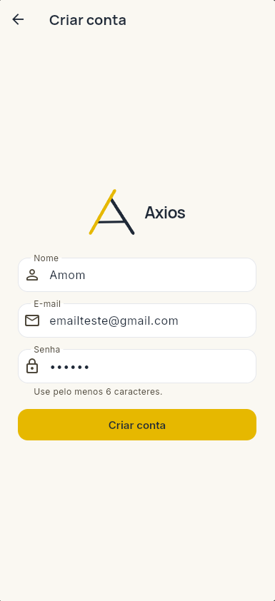
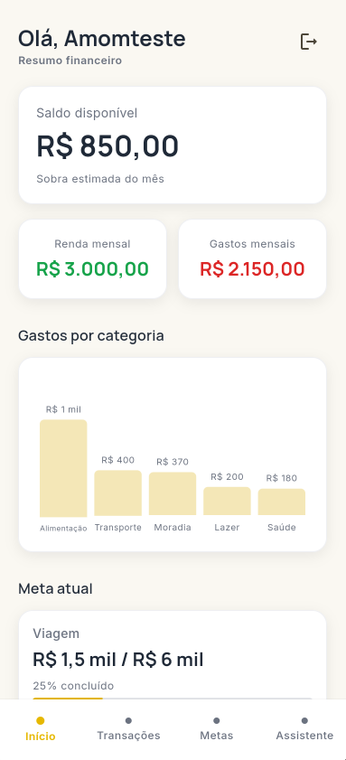
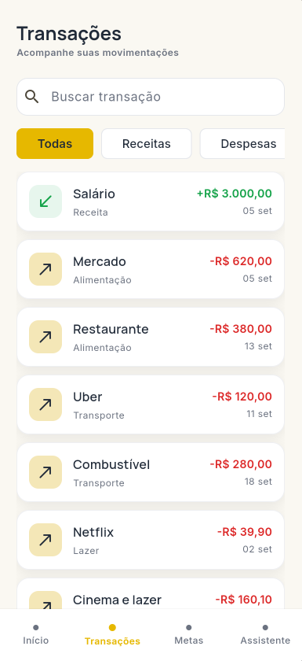
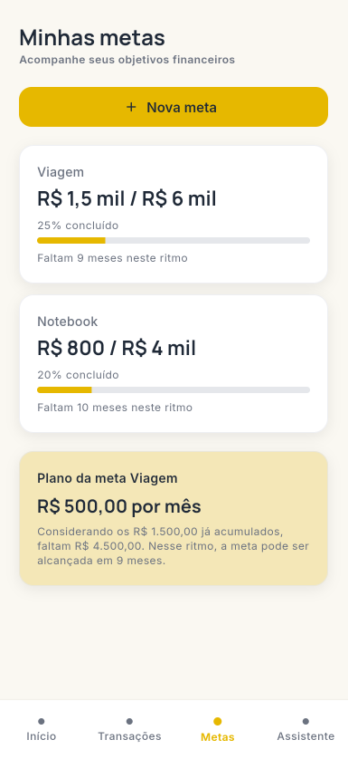
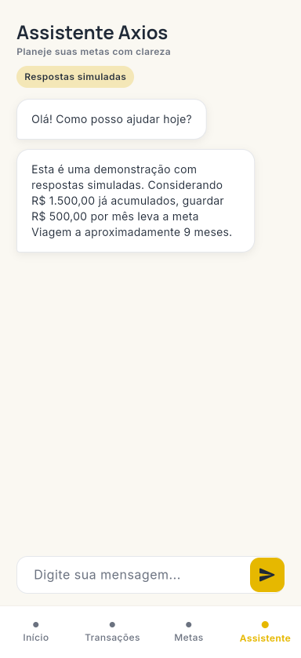

# Axios

**Seu planejamento financeiro, de forma inteligente.**

O Axios é um aplicativo acadêmico de planejamento financeiro em Flutter. A
proposta é transformar movimentações financeiras em uma visão clara de receitas,
despesas, resultado mensal e planos alcançáveis para metas pessoais.

## Status — CP6, Etapa 1

A primeira etapa do Checkpoint 6 evolui o protótipo do CP5 para um gerenciador
financeiro funcional:

- CRUD de receitas e despesas, com data, categoria, busca e filtros;
- valores monetários de transações armazenados em centavos inteiros;
- persistência das transações em `users/{uid}/transactions` no Cloud Firestore;
- Dashboard calculado a partir do mesmo repositório das transações;
- seleção mensal e separação entre resultado do mês e saldo bancário;
- importação local do extrato PDF de referência, com prévia e revisão;
- deduplicação e substituição restrita por origem e período;
- criação, edição, exclusão e aportes em metas;
- motor financeiro puro e testável;
- backend Node/TypeScript protegido por Firebase ID Token para o Pluggy Sandbox;
- Pluggy Connect preparado para Android pelo SDK oficial;
- assistente determinístico preservado, sem IA generativa.

Autenticação e metas foram validadas manualmente no Firebase no CP5. O código e
as regras das transações foram implementados nesta etapa, mas ainda precisam ser
publicados e validados no projeto Firebase. A conexão Pluggy real também depende
de credenciais Development válidas e de um backend HTTPS acessível ao aparelho;
portanto, ela não é apresentada como validada de ponta a ponta.

## Capturas de tela — Checkpoint 5

As imagens abaixo registram a interface consolidada no CP5. As novas ações do CP6
preservam o mesmo Design System.

<table>
  <tr>
    <td align="center" width="33%">
      <br>
      <sub><strong>Login</strong> — acesso com e-mail e senha</sub>
    </td>
    <td align="center" width="33%">
      <br>
      <sub><strong>Cadastro</strong> — criação de uma nova conta</sub>
    </td>
    <td align="center" width="33%">
      <br>
      <sub><strong>Dashboard</strong> — resumo financeiro e meta atual</sub>
    </td>
  </tr>
  <tr>
    <td align="center" width="33%">
      <br>
      <sub><strong>Transações</strong> — busca, filtros e movimentações</sub>
    </td>
    <td align="center" width="33%">
      <br>
      <sub><strong>Metas</strong> — progresso e planejamento mensal</sub>
    </td>
    <td align="center" width="33%">
      <br>
      <sub><strong>Assistente</strong> — respostas financeiras simuladas</sub>
    </td>
  </tr>
  <tr>
    <td align="center" colspan="3">
      <br>
      <sub><strong>Nova meta</strong> — formulário de criação e planejamento</sub>
    </td>
  </tr>
</table>

## Funcionalidades financeiras

### Transações

- Adição, edição e exclusão com confirmação.
- Receita ou despesa, descrição, valor, data e categoria.
- Busca por texto e filtros por tipo e categoria.
- Estados de carregamento, erro e lista vazia.
- Origem identificada como `manual`, `pdf` ou `pluggy`.
- ID externo, lote e impressão digital quando a origem oferece esses dados.
- Registros marcados como transferências internas ou pagamento de fatura podem
  ser excluídos dos totais para evitar dupla contabilização.

Em execução Firebase, a fonte é o Firestore. Dados simulados aparecem somente no
modo demonstração explícito e nos testes; eles não são inseridos automaticamente
na conta de um usuário real.

### Dashboard dinâmico

O Dashboard utiliza o período mensal selecionado e calcula:

- total de receitas;
- total de despesas;
- resultado líquido do mês;
- capacidade estimada de poupança;
- distribuição de despesas por categoria;
- meta em destaque.

O resultado mensal é apresentado como receitas menos despesas e não como saldo
da conta. O Axios só deve exibir saldo bancário quando essa informação vier de uma
fonte bancária conhecida.

### Metas e planejamento

- Criação, edição e exclusão de metas.
- Alteração de prazo, objetivo e valor acumulado.
- Registro de aportes.
- Progresso e conclusão.
- Valor mensal necessário e aviso de orçamento insuficiente.
- Leitura retrocompatível dos documentos de metas do CP5.

Exemplo: para um objetivo de R$ 6.000,00 com R$ 1.500,00 acumulados, restam
R$ 4.500,00. Em oito meses, o valor necessário é R$ 562,50 por mês.

## Importação de extrato PDF

O fluxo está disponível na ação de PDF da tela **Transações**:

1. selecione um arquivo `.pdf` de até 10 MB;
2. o app valida extensão e assinatura `%PDF-`;
3. o texto selecionável é extraído localmente com `pdfrx`;
4. datas, descrições, valores e natureza da movimentação são interpretados;
5. a prévia mostra totais, categorias, possíveis duplicatas e ambiguidades;
6. categorias podem ser corrigidas e itens podem ser removidos;
7. escolha **Adicionar sem duplicar** ou **Substituir importados do período**;
8. confirme a gravação.

O PDF não é enviado a IA nem a serviços externos. O parser atual é deliberadamente
específico para o layout acadêmico em:

```text
docs/fixtures/extrato_bancario_ficticio_amom_ianaguivara_setembro_2026.pdf
```

Nesse documento, o parser confere 30 movimentações entre 01/09/2026 e
30/09/2026, R$ 4.214,75 de entradas e R$ 2.944,67 de saídas. Saldo inicial,
saldo final, cabeçalhos, rodapés e totais agregados não são importados. PDFs com
imagem digitalizada não têm OCR nesta etapa, e outros layouts bancários podem
exigir um parser adicional.

### Deduplicação e substituição

Cada lançamento PDF recebe SHA-256 de data, descrição normalizada e valor com
sinal. Transações Pluggy usam o identificador externo como impressão digital.

- **Adicionar sem duplicar:** preserva tudo e ignora impressões digitais já
  existentes.
- **Substituir importados do período:** remove somente registros da mesma origem
  dentro do período exibido na prévia. Itens manuais e de outras origens são
  preservados.

Cada importação aceita até 400 alterações e é gravada em um único lote atômico do
Firestore. Uma falha na preparação ou confirmação não modifica o histórico
existente.

## Pluggy Sandbox

O repositório inclui um backend independente em `backend/` e o fluxo móvel com
`flutter_pluggy_connect`:

1. o Flutter obtém o Firebase ID Token do usuário autenticado;
2. o backend valida o token com Firebase Admin;
3. o backend troca `CLIENT_ID` e `CLIENT_SECRET` por uma API Key da Pluggy;
4. um Connect Token de curta duração é criado com `clientUserId = uid`;
5. o SDK abre somente os conectores Sandbox;
6. o backend confirma que o Item pertence ao UID e armazena a associação;
7. contas e transações são consultadas no servidor e normalizadas;
8. o usuário revisa os lançamentos antes de persistir no Firestore.

O `CLIENT_SECRET` nunca vai para o Flutter, APK ou Firestore acessível ao cliente.
O backend não registra tokens nem transações completas em logs. Ele aplica CORS,
headers seguros, limite de requisições e validação de entrada.

### Configurar o backend

Requisitos: Node.js 20 ou superior e credenciais Development da Pluggy.

```powershell
cd backend
Copy-Item .env.example .env
npm install
npm run check
npm test
npm run dev
```

Preencha o `.env` local com:

- `PLUGGY_CLIENT_ID` e `PLUGGY_CLIENT_SECRET` do ambiente Development;
- `FIREBASE_PROJECT_ID`;
- Application Default Credentials do Firebase Admin;
- origens Web permitidas em `ALLOWED_ORIGINS`.

Nunca versione `.env` ou uma service account. Para Android físico e para o APK
final, hospede a API em um endpoint HTTPS. `localhost` aponta para o próprio
celular e não representa uma integração móvel final. Não é necessário alterar o
Firebase para o plano Blaze para executar esse backend de forma independente.

Execute o app informando a URL pública do backend:

```powershell
flutter run -d <id-android> `
  --dart-define=AXIOS_BACKEND_URL=https://api-exemplo.seudominio.dev
```

O pacote oficial `flutter_pluggy_connect` 3.0.1 suporta Android, iOS e macOS, mas
não Web. Por isso, o botão informa essa limitação no Edge e mantém cadastro manual
e importação PDF funcionando normalmente. Trial expirado, credenciais ausentes ou
backend indisponível são tratados como falha; o app não simula sucesso.

## Tecnologias

| Tecnologia | Uso |
| --- | --- |
| Flutter 3.47 / Dart 3.13 | UI Android/Web, navegação e estado |
| Firebase Authentication | Cadastro, sessão, login e logout |
| Cloud Firestore | Metas e transações isoladas por UID |
| `ChangeNotifier` | Estado simples no `AppController` |
| `file_picker` | Seleção de PDF em Android e Web |
| `pdfrx` | Extração local de texto selecionável em PDF |
| `crypto` | Hash SHA-256 de lotes e lançamentos |
| `flutter_pluggy_connect` | Pluggy Connect no Android |
| Node.js, TypeScript e Express | API protegida para operações Pluggy |
| Firebase Admin | Validação do Firebase ID Token no backend |
| `intl` | Moeda e datas em português |
| Inter e Manrope | Tipografia local |

As bibliotecas adicionadas para PDF e Pluggy usam licença MIT. Nenhuma dependência
comercial de extração de PDF foi incluída.

## Arquitetura

```text
lib/
  app_dependencies.dart       # composição Firebase ou demo
  models/                      # dinheiro, transação, categoria, meta e usuário
  repositories/               # contratos, Firestore e implementações em memória
  services/
    financial_engine.dart      # cálculos puros
    statement_import.dart      # seleção, extração, parser e preparação
    pluggy_service.dart        # cliente autenticado do backend
  state/app_controller.dart    # sessão, streams, comandos e período
  screens/                     # UI e fluxos de revisão
  widgets/                     # componentes reutilizáveis
backend/
  src/                         # Express, Firebase Admin e gateway Pluggy
  test/                        # autorização e isolamento de usuário
docs/
  fixtures/                    # extrato fictício usado nos testes
  screenshots/                 # galeria do CP5
test/                          # testes unitários e de widgets Flutter
firestore.rules                # menor privilégio por UID e validação de campos
```

### Decisões técnicas desde o CP4

- O Design System do CP4 permanece como tema Flutter.
- O `IndexedStack` do CP5 continua preservando as abas.
- Formulários em bottom sheets são `StatefulWidget`s donos de seus próprios
  `TextEditingController`s; operações assíncronas verificam `mounted`.
- Repositórios isolam UI, Firebase e implementações em memória.
- Centavos inteiros são a fonte de verdade das novas transações.
- Metas permanecem no esquema decimal do CP5 para não invalidar documentos já
  gravados, mas os cálculos novos convertem os valores para centavos quando
  precisam de exatidão.
- A integração privilegiada da Pluggy fica fora do cliente.
- O assistente continua determinístico para ser substituído com segurança na
  Etapa 2.

## Configuração Firebase

O app usa `lib/firebase_options.dart` e `android/app/google-services.json`. Em um
novo ambiente:

1. configure o projeto pelo FlutterFire CLI;
2. habilite Authentication por e-mail e senha;
3. crie o Cloud Firestore;
4. publique `firestore.rules` no projeto correto;
5. valide cadastro, metas e transações com um usuário de teste.

Depois de confirmar o projeto ativo no Firebase CLI, publique somente as regras:

```powershell
firebase deploy --only firestore:rules
```

Esse comando altera o projeto remoto e não é executado automaticamente por esta
entrega.

Estruturas principais:

```text
users/{uid}/goals/{goalId}
users/{uid}/transactions/{transactionId}
users/{uid}/pluggyItems/{itemId}   # escrita exclusiva pelo backend Admin
```

As regras exigem autenticação, UID correspondente, tipos de campo válidos,
valores positivos e origens conhecidas. O fallback global nega acesso. O Firebase
Admin ignora regras de cliente e, por isso, o backend sempre valida o ID Token e a
propriedade do Item antes de consultar dados Pluggy.

## Como executar

Na raiz:

```powershell
C:\devflutter\flutter\bin\flutter.bat pub get
C:\devflutter\flutter\bin\flutter.bat devices
C:\devflutter\flutter\bin\flutter.bat run -d edge
```

Android:

```powershell
C:\devflutter\flutter\bin\flutter.bat run -d <id-do-dispositivo>
```

### Modo demonstração

O modo demo é explícito, usa repositórios em memória e não acessa dados reais:

```powershell
C:\devflutter\flutter\bin\flutter.bat run -d edge `
  --dart-define=AXIOS_DEMO_MODE=true
```

Na execução normal, falha de Firebase é exibida ao usuário; não existe fallback
silencioso para dados fictícios.

## Testes e builds

Flutter:

```powershell
C:\devflutter\flutter\bin\dart.bat format .
C:\devflutter\flutter\bin\flutter.bat analyze
C:\devflutter\flutter\bin\flutter.bat test
C:\devflutter\flutter\bin\flutter.bat build web
C:\devflutter\flutter\bin\flutter.bat build apk --debug
```

Backend:

```powershell
cd backend
npm run check
npm test
npm run build
```

Os testes incluem:

- dinheiro em centavos e cálculos financeiros extremos;
- CRUD, filtros e formulário de transações;
- parser do PDF real, duas páginas, datas, sinais e totais;
- arquivo vazio, assinatura inválida, ambiguidade e cancelamento;
- deduplicação, reimportação e substituição por origem/período;
- CRUD e aportes de metas;
- navegação e regressão de ciclo de vida dos bottom sheets;
- autenticação e autorização dos endpoints Pluggy com dependências falsas.

Testes automatizados não escrevem no Firebase real nem chamam a Pluggy real.

Validação local desta entrega:

| Verificação | Resultado |
| --- | --- |
| `dart format .` | concluído |
| `flutter analyze` | nenhuma ocorrência |
| `flutter test` | 32 testes aprovados |
| `flutter build web` | concluído em `build/web` |
| `flutter build apk --debug` | concluído em `build/app/outputs/flutter-apk/app-debug.apk` |
| `npm run check` / `npm run build` | concluídos |
| `npm test` | 5 testes de backend aprovados |
| Android físico | pendente; nenhum dispositivo estava conectado |
| Firebase das transações | pendente de publicar regras e validar manualmente |
| Pluggy ponta a ponta | pendente de credenciais e backend HTTPS |

O build Android emitiu um aviso futuro sobre plugins Firebase que ainda aplicam
o Kotlin Gradle Plugin. Ele não impediu o APK atual, mas deve ser acompanhado em
atualizações do FlutterFire. Build não substitui QA em aparelho físico.

## Limitações conhecidas e Etapa 2

- As regras novas ainda precisam ser publicadas e validadas no Firebase.
- Pluggy exige credenciais Development, trial ativo e backend HTTPS hospedado.
- O SDK Flutter oficial da Pluggy não suporta Web.
- O parser PDF suporta o layout acadêmico de referência; não há OCR nem suporte
  universal a bancos.
- A detecção de transferências internas depende dos metadados fornecidos pela
  instituição e deve ser revisada pelo usuário.
- O Assistente Axios ainda usa respostas simuladas.
- Notificações, observabilidade, migração avançada e APK release pertencem aos
  próximos refinamentos.

Na Etapa 2 estão previstos Gemini, limites e transparência da IA, refinamentos de
acessibilidade, QA Android completo, backend hospedado e APK release assinado.

## Identidade visual

| Cor | Código | Uso |
| --- | --- | --- |
| Background | `#FAF8F2` | Fundo principal |
| Axios Gold | `#E6B800` | Ações e destaques |
| Gold Soft | `#F4E7B7` | Superfícies de destaque |
| Graphite | `#1F2937` | Títulos e textos principais |
| Gray | `#6B7280` | Textos secundários |
| Surface | `#FFFFFF` | Cartões e campos |
| Border | `#E5E7EB` | Contornos e divisores |
| Success | `#16A34A` | Receitas e estados positivos |
| Danger | `#DC2626` | Despesas e erros |

Manrope é usada em títulos, marca e números financeiros; Inter é usada em textos,
formulários, botões e navegação. A logo preserva o “A” geométrico dourado e
grafite definido no Figma.

## Equipe

- Amom Ianaguivara — RM 565718
- Fernando Antônio — RM 562549
- Gabriel Ramos Moreira — RM 564074
- Vinicius Mello Siqueira — RM 565257
- Victor Chen — RM 565363

## Histórico acadêmico

### Checkpoint 4

O CP4 definiu proposta, identidade visual, público e protótipo no Figma. O projeto
Flutter tinha apenas a tela inicial da marca; as demais telas, Firebase, gráficos
e interações ainda eram planejados.

O público-alvo inicial são jovens adultos e pessoas que desejam organizar sua
vida financeira e transformar dados em planos claros. O modelo acadêmico
considerado é freemium, com uma base gratuita e possíveis análises avançadas.

### Checkpoint 5

O CP5 implementou login e cadastro Firebase, cinco telas, navegação com estado,
metas persistidas no Firestore, dados financeiros simulados, testes e APK debug.
O formulário de metas passou a controlar corretamente o ciclo de vida de seus
controllers em Android. Transações reais, PDF e Pluggy ainda não faziam parte do
escopo concluído naquele checkpoint.
